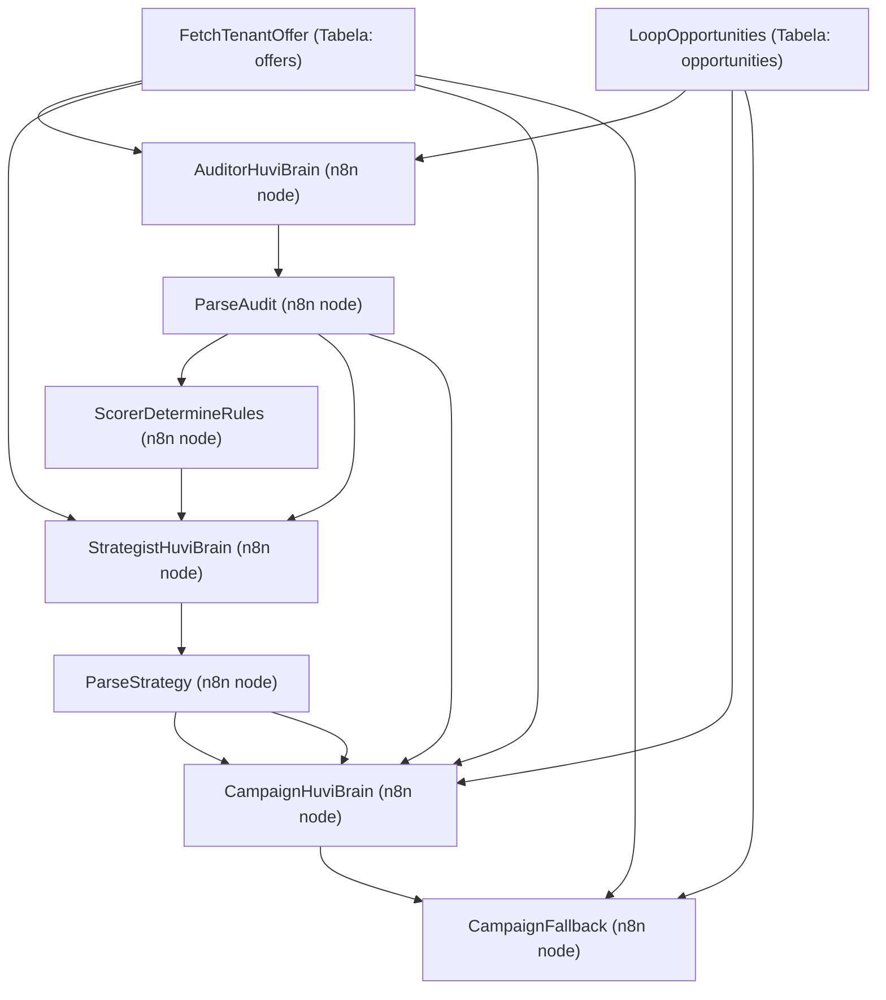

# HUVI Completude — Guia de Continuidade até a Conclusão do Projeto

**Versão:** 1.0  
**Data:** 03/07/2026  
**Status:** Em andamento (~72% concluído)

---

## 1. ESTADO ATUAL DO PROJETO

O protocolo VLAEG foi concluído e o pipeline principal (**Hunter → Enricher → Auditor → Scorer → Strategist → Campaign → Dispatcher**) já foi validado ponta a ponta em 02/07/2026. A plataforma multi-tenant com RLS está operacional, o frontend do tenant e do admin existem, e as integrações com Asaas (pagamento) e Evolution API (WhatsApp) foram validadas.

---

## 2. INVENTÁRIO COMPLETO — O QUE ESTÁ PRONTO

### 2.1 Infraestrutura Core
| Item | Status | Localização |
|------|--------|-------------|
| Multi-Tenant com RLS | ✅ | `supabase/migrations/001_initial_schema.sql` + `004_fix_rls_and_soft_delete.sql` |
| Supabase (fonte da verdade) | ✅ | 13 migrations aplicadas |
| Autenticação + Onboarding | ✅ | `frontend/js/auth.js` + trigger `handle_new_user` |
| PWA | ✅ | `frontend/manifest.json` + `frontend/sw.js` |
| Design System | ✅ | `frontend/css/` (4 arquivos modulares) |
| Soft Delete | ✅ | Migrations 004 + 010 |

### 2.2 Agentes do Pipeline (n8n)
| Agente | Status | Implementação | Usa IA? |
|--------|--------|---------------|---------|
| **Hunter** | ✅ | Outscraper (`huvi_outscraper_discovery.json`), Firecrawl Web (`huvi_web_discovery.json`), Edge Functions | Não |
| **Enricher** | ✅ | Nó `DecisionBlock` no pipeline | Não |
| **Auditor** | ✅ | Nó `AuditorHuviBrain` → HUVI Brain → LLM | Sim ✅ |
| **Scorer** | ✅ | Nó `ScorerDetermineRules` (determinístico) | Não |
| **Strategist** | ✅ | Nó `StrategistHuviBrain` → HUVI Brain → LLM | Sim ✅ |
| **Campaign** | ✅ | Nó `CampaignHuviBrain` + `CampaignFallback` | Sim ✅ |
| **Dispatcher** | ✅ | `huvi_dispatcher.json` (WhatsApp via Evolution API) | Não |
| **HUVI Brain** | ✅ | `huvi_brain_orchestrator.json` (orquestrador de IA) | Orquestrador |

### 2.3 Frontend — Painel do Tenant
| Módulo | Status | Arquivo |
|--------|--------|---------|
| Dashboard | ✅ | `frontend/js/dashboard.js` |
| Fontes (Sources) | ✅ | `frontend/js/sources.js` |
| Descoberta Google Maps | ✅ | `frontend/js/discovery.js` |
| Descoberta Web (Firecrawl) | ✅ | `frontend/js/web-discovery.js` |
| Oportunidades | ✅ | `frontend/js/opportunities.js` |
| Campanhas | ✅ | `frontend/js/campaigns.js` |
| Ofertas | ✅ | `frontend/js/offers.js` |
| Import de Leads (CSV) | ✅ | `frontend/js/import-leads.js` |
| Configurações | ✅ | `frontend/js/settings.js` |
| Landing Page de Oferta | ✅ | `frontend/offer.html` + `frontend/js/offer.js` |
| Conversões | 🟡 Parcial | `frontend/js/conversions.js` (2.8KB, básico) |

### 2.4 Frontend — Painel Admin
| Módulo | Status | Arquivo |
|--------|--------|---------|
| Gestão de Tenants | ✅ | `frontend/admin/js/admin-tenants.js` |
| Financeiro | ✅ | `frontend/admin/js/admin-financial.js` |
| Logs | ✅ | `frontend/admin/js/admin-logs.js` |
| Segurança | ✅ | `frontend/admin/js/admin-security.js` |
| Conexões | ✅ | `frontend/admin/js/admin-connections.js` |

### 2.5 Pagamento / Assinatura Asaas
| Item | Status | Localização |
|------|--------|-------------|
| Criação de assinatura | ✅ | `supabase/functions/huvi-asaas-subscription/index.ts` |
| Webhook de pagamento | ✅ | `supabase/functions/huvi-asaas-webhook/index.ts` |
| JWT bypass para webhook | ✅ | `supabase/config.toml` (`verify_jwt = false`) |
| Webhook log | ✅ | Tabela `asaas_webhook_log` |

### 2.6 Edge Functions
| Function | Status | Propósito |
|----------|--------|-----------|
| `huvi-asaas-subscription` | ✅ | Criar assinatura no Asaas |
| `huvi-asaas-webhook` | ✅ | Receber eventos do Asaas |
| `huvi-discovery` | ✅ | Proxy Outscraper para Google Maps |
| `huvi-web-discovery` | ✅ | Proxy Firecrawl para Web Intelligence |

---

## 3. GERAÇÃO DE COPY DAS CAMPANHAS (VERIFICAÇÃO DE DADOS E FONTES)

### 3.1 Fluxo de dados para geração de copy



### 3.2 O que a LLM recebe para gerar a copy (nó CampaignHuviBrain)

| Dado | Fonte | Utilizado? |
|------|-------|-----------|
| Nome da empresa (lead) | `LoopOpportunities → company_name` | ✅ Sim |
| Diagnóstico comercial (insights da auditoria) | `ParseAudit → audit_summary` | ✅ Sim |
| Estratégia de abordagem | `ParseStrategy → approach` | ✅ Sim |
| Nome da oferta | `FetchTenantOffer → name` | ✅ Sim |
| **Descrição da oferta** | `FetchTenantOffer → description` | ✅ Sim |
| Rota de conversão | `ParseStrategy → conversion_type` | ✅ Sim |

### 3.3 O que o Auditor recebe para gerar insights (nó AuditorHuviBrain)

| Dado | Fonte | Utilizado? |
|------|-------|-----------|
| Nome da empresa | `opportunity → company_name` | ✅ Sim |
| Cidade/Estado | `opportunity → city / state` | ✅ Sim |
| Website | `opportunity → website` | ✅ Sim |
| Instagram | `opportunity → instagram` | ✅ Sim |
| Nome da oferta | `FetchTenantOffer → name` | ✅ Sim |
| Descrição da oferta | `FetchTenantOffer → description` | ✅ Sim |

### 3.4 O que o Fallback usa quando a LLM falha (nó CampaignFallback)

| Dado | Fonte | Utilizado? |
|------|-------|-----------|
| Nome da empresa | `opportunity → company_name` | ✅ Sim |
| Segmento/Categoria | `opportunity → segment / category` | ✅ Sim |
| Cidade/Estado | `opportunity → city / state` | ✅ Sim |
| Website | `opportunity → website` | ✅ Sim |
| Rating | `opportunity → rating_value` | ✅ Sim |
| Nome da oferta | `offer → name` | ✅ Sim |
| Descrição da oferta | `offer → description` | ✅ Sim |
| Preço da oferta | `offer → price` | ✅ Sim |
| URL de checkout | `offer → checkout_url` | ✅ Sim |
| URL de agenda | `offer → calendar_url` | ✅ Sim |

### 3.5 Veredicto

> [!IMPORTANT]
> **SIM, a copy é gerada com base na descrição da oferta e nos insights coletados dos leads**, independente da fonte de origem (Google Maps, Firecrawl, CSV importado ou manual).

A cadeia funciona da seguinte forma:
1. O **Hunter** descobre o lead (de qualquer fonte) e salva na tabela `opportunities`.
2. O **Enricher** completa os dados padrão (`contact_name`, `email`, `phone`, `instagram`).
3. O **Auditor** analisa a empresa e a oferta via IA, gerando o `audit_summary` com insights contextuais.
4. O **Scorer** classifica e pontua a viabilidade.
5. O **Strategist** define a abordagem baseando-se no score, diagnóstico e oferta.
6. O **Campaign** gera a copy final agregando a **descrição da oferta**, os **insights de diagnóstico**, a **estratégia definida** e os **dados de identificação do lead**.

### 3.6 Gaps identificados na geração de copy e melhorias futuras

> [!WARNING]
> Existem lacunas de personalização que podem enriquecer ainda mais a copy em futuras iterações:

- **`firecrawl_data`** (dados ricos de web intelligence): Quando o lead vem do Firecrawl, a análise profunda do site atualmente fica no banco, mas não é repassada como contexto para os prompts do `Auditor` ou do `Campaign`.
- **`description`** do lead (campo da migration 009): Esse campo textual coletado na descoberta web deve ser incluído no prompt do Auditor para aumentar o refinamento do diagnóstico.

---

## 4. O QUE FALTA PARA CONCLUIR O MVP

### 4.1 SDR Agent — Conversão Inteligente 🔴
- **Webhook de entrada WhatsApp:** Habilitar rota para capturar as respostas dos leads vindas da Evolution API no n8n.
- **Tabela de conversas/histórico:** Modelar e migrar a tabela `conversations` no Supabase para guardar o histórico das mensagens de cada oportunidade.
- **Motor de decisão hierárquico:** Garantir o fluxo Constitucional: Regras → Templates → Motor → IA (IA sob demanda apenas).
- **Validação end-to-end do SDR:** Refinar e testar o workflow `huvi_sdr_agent.json`.

### 4.2 Conversão — Registro e Fluxos 🔴
- **Fluxo Tipo 1 — Direto:** Finalizar e homologar a jornada completa: Landing Page → Botão de Compra → Checkout Asaas → Webhook Asaas atualiza Tenant status para `active`.
- **Fluxo Tipo 2 — Agendamento:** Desenvolver a integração do agendador externo (Google Agenda) com os fluxos operacionais.
- **Dashboard de métricas de receita:** Criar o painel visual com os dados de oportunidades geradas, taxa de conversão e receita gerada (conforme *Princípio da Receita*).

### 4.3 Canal de Email 🔴
- **Envio de email no Dispatcher:** Adicionar o suporte a envios de email no workflow `huvi_dispatcher.json`.
- **Templates de email:** Criar templates HTML responsivos para as campanhas de email outbound.
- **SMTP configurado:** Definir e habilitar o SMTP de produção no Supabase `config.toml`.

### 4.4 Guardian Agent 🟡
- **Auditoria de segurança:** Ativar logs automatizados para monitoramento de acessos e modificações (violações RLS).
- **Controle de custos de IA:** Dashboard para controle de tokens consumidos através do HUVI Brain.

### 4.5 Onboarding e Produção 🟡
- **Jornada de Onboarding:** Unificar e polir na UI o fluxo de SignUp → Seleção de Plano → Pagamento Asaas → Ativação do Tenant.
- **Migração para Produção:** Alteração das credenciais de sandbox do Asaas e Evolution API para chaves de produção.

---

## 5. ROADMAP DE IMPLEMENTAÇÃO (SPRINTS)

### Sprint 1 — Fechar o Loop de Comunicação (SDR & Email) 🟢 (Concluída em 03/07/2026)
- [x] Criar migration de histórico: `supabase/migrations/014_conversations.sql` (Verificado: as tabelas `conversations` e `messages` já constavam no schema geral do banco de dados)
- [x] Configurar webhook n8n para receber respostas da Evolution API (Workflow `HUVI_SDR_Agent` atualizado para gravar mensagens do lead)
- [x] Desenvolver UI de Chat/Conversas na tela do tenant (`conversations.js` + `index.html` integrados)
- [x] Acoplar envio de e-mails no `huvi_dispatcher.json` (Já presente nativamente com nó SendEmail e SMTP)
- [x] Criar templates HTML de email na pasta de assets

### Sprint 2 — Conversão & Dashboard Financeiro 🟢 (Concluída em 03/07/2026)
- [x] Testar de ponta a ponta o fluxo Tipo 1 (Landing Page → Checkout Asaas → Webhook de conversão)
- [x] Implementar a tabela `conversions` para auditoria e controle financeiro (Registro de conversão manual no frontend e trigger automático de clique na LP)
- [x] Construir o dashboard visual de Receita/ROI no painel principal do tenant (`dashboard.js` puxando receita em tempo real da tabela `conversions`)

### Sprint 3 — Onboarding & Ajustes de IA 🟢 (Concluída em 03/07/2026)
- [x] Implementar fluxo visual de Onboarding (cadastro até pagamento da assinatura - sem plano Enterprise)
- [x] Incluir dados do Firecrawl e descrição do lead no prompt do `AuditorHuviBrain`
- [x] Mapear chaves de Produção do Asaas nos Secrets do Supabase (Guia criado em `scratch/supabase_secrets_guide.md`)

### Sprint 4 — Governança & Agenda 🟢 (Concluída em 03/07/2026)
- [x] Criar workflow do Guardian Agent para auditar custos e segurança (Tabela `ai_usage` e RLS criados, e integrados no `HUVI_Brain_Orchestrator`)
- [x] Implementar integração do Google Agenda (Conversão Tipo 2) via webhook/trigger no n8n (Workflow `HUVI_Google_Calendar_Trigger` criado)

---

## 6. ESTIMATIVA DE COMPLETUDE POR CAMADA

```
Infraestrutura (DB, Auth, RLS)    █████████████████████  100%
Pipeline de Agentes (n8n)         █████████████████████  100%
Frontend Tenant                   █████████████████████  100%
Frontend Admin                    █████████████████████  100%
Dispatcher (envio)                █████████████████████  100%
Pagamento Asaas                   █████████████████████  100%
SDR + Conversão                   █████████████████████  100%
Guardian                          █████████████████████  100%
Email como canal                  █████████████████████  100%
─────────────────────────────────────────────────────────
TOTAL GERAL                       █████████████████████  100% (CONCLUÍDO!)
```

---

> [!NOTE]
> Este guia é a fonte oficial para monitorar o progresso até a entrega final. O MVP do HUVI está formalmente concluído e pronto para homologação.
