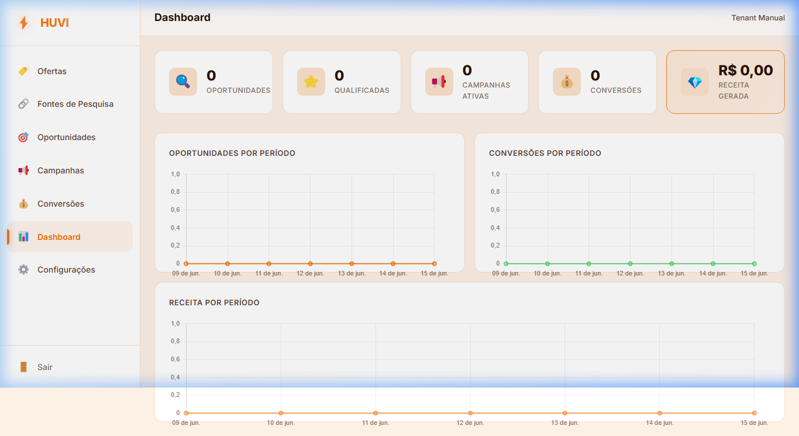
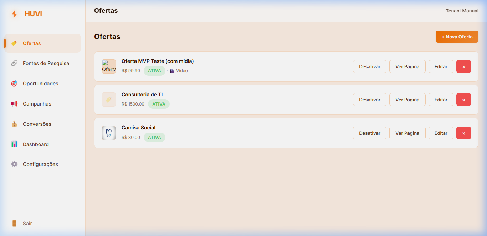
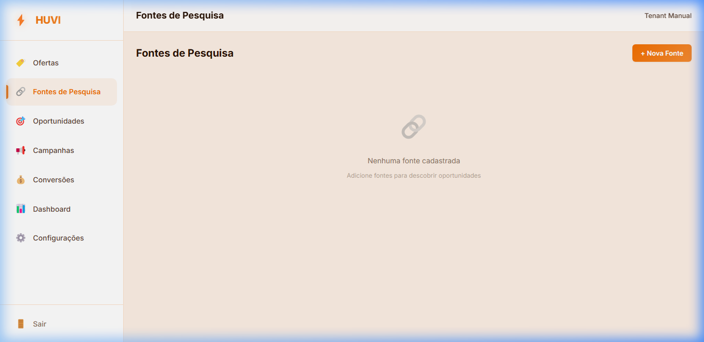
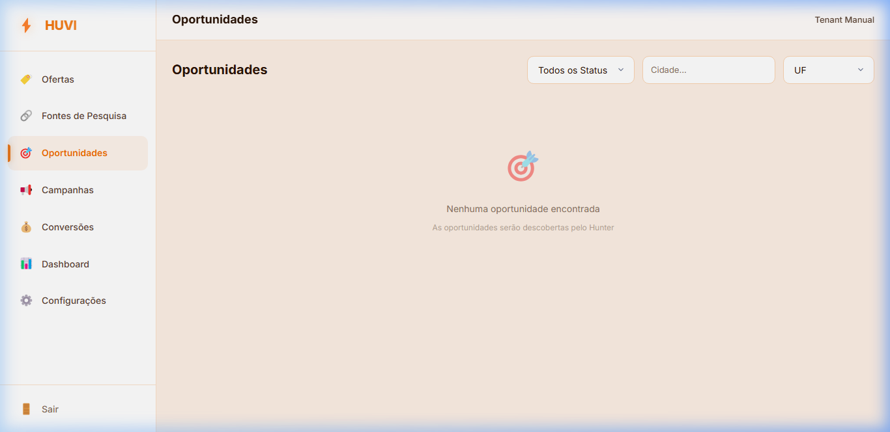
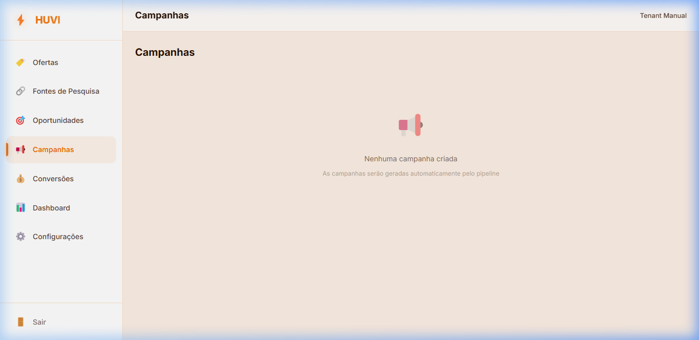
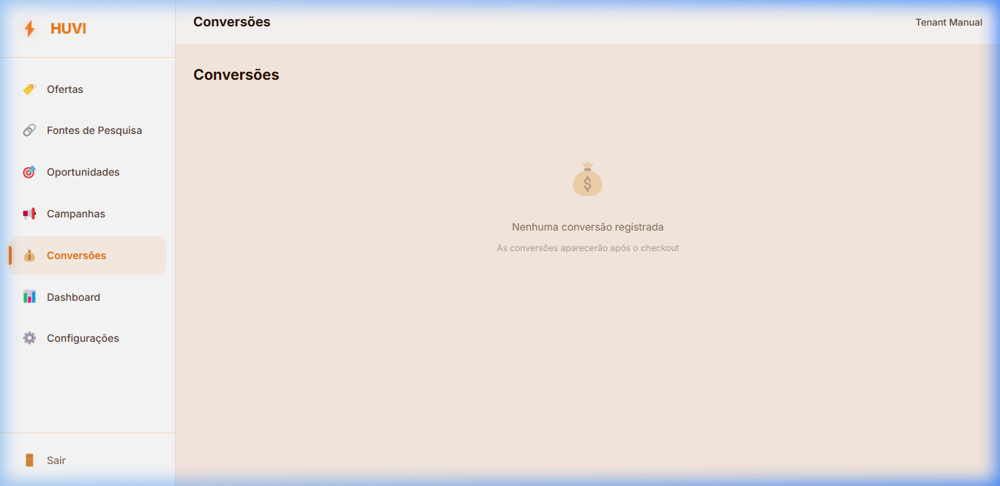
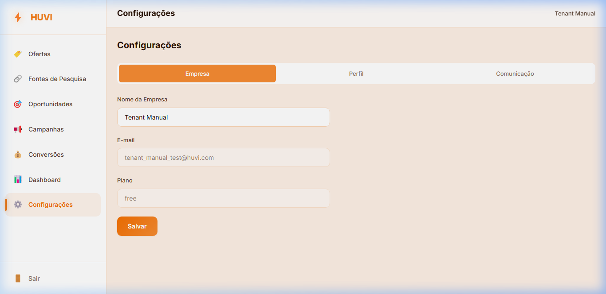

# ⚡ Manual do Usuário Tenant — HUVI (Hub de Vendas Inteligente)
## O Guia Definitivo para Escalar suas Vendas com Inteligência Artificial e Automação

---

## 📖 Introdução: O que é o HUVI?

O **HUVI (Hub de Vendas Inteligente)** é uma plataforma SaaS multi-tenant inovadora, projetada para transformar produtos, serviços e leads brutos em oportunidades reais de conversão e receita recorrente. 

A filosofia central do HUVI é baseada no **Princípio do ROI e da Geração de Receita**: o sistema não é projetado com foco em métricas de vaidade, mas sim em métricas reais de negócios: **oportunidades qualificadas**, **campanhas ativas**, **conversões concluídas** e **receita financeira gerada**.

Para alcançar esse objetivo de forma escalável e automática, o HUVI utiliza uma arquitetura inteligente de agentes baseada no motor **HUVI Brain** integrada a pipelines no **n8n** e armazenamento seguro no **Supabase**.

Este manual guiará você, **Tenant (Cliente do HUVI)**, por todas as abas e ferramentas da plataforma, fornecendo um passo a passo prático para configurar suas ofertas, capturar leads e convertê-los em clientes pagantes.

---

## 🗂️ Índice do Manual
1. [Primeiro Acesso e Cadastro](#1-primeiro-acesso-e-cadastro)
2. [O Dashboard Principal](#2-o-dashboard-principal)
3. [Cadastrando e Gerenciando Ofertas (Menu Ofertas)](#3-cadastrando-e-gerenciando-ofertas-menu-ofertas)
4. [Capturando Leads (Menu Fontes de Pesquisa)](#4-capturando-leads-menu-fontes-de-pesquisa)
   - [Upload de Arquivos e Mapeamento de Colunas](#upload-de-arquivos-e-mapeamento-de-colunas)
5. [O Pipeline de Vendas (Menu Oportunidades)](#5-o-pipeline-de-vendas-menu-oportunidades)
   - [Abas do Modal de Detalhes (Informações, Diagnóstico, Classificação e Estratégia)](#abas-do-modal-de-detalhes)
6. [Engajamento Automático (Menu Campanhas)](#6-engajamento-automático-menu-campanhas)
7. [Acompanhamento de Conversões (Menu Conversões)](#7-acompanhamento-de-conversões-menu-conversões)
8. [Configurações Gerais e Regras de Comunicação](#8-configurações-gerais-e-regras-de-comunicação)
9. [Boas Práticas para Maximizar seus Resultados](#9-boas-práticas-para-maximizar-seus-resultados)

---

## 1. Primeiro Acesso e Cadastro

Para iniciar no HUVI, você deve acessar o endereço do aplicativo e criar sua conta.

1. Acesse a tela inicial no navegador.
2. Clique no link **"Criar conta"**.
3. Preencha seu **Nome Completo**, seu **E-mail corporativo** e defina uma **Senha segura** (mínimo de 8 caracteres).
4. Clique em **Criar conta**.

> [!NOTE]  
> Durante o registro, o HUVI executa um fluxo automático (*onboarding trigger*) no banco de dados, configurando de forma transparente suas preferências de comunicação, criando seu perfil de empresa exclusivo e preparando seu ambiente isolado de dados (RLS). Nenhuma empresa parceira ou outro tenant poderá visualizar as suas informações.

---

## 2. O Dashboard Principal

Ao fazer login na plataforma, você será direcionado para o painel de controle central, o **Dashboard**. Esta tela é o seu painel de bordo executivo, fornecendo uma visão macro sobre a saúde do seu funil comercial.

### KPIs Principais:
*   **Oportunidades:** Quantidade total de leads capturados em suas Fontes de Pesquisa que entraram no pipeline do HUVI.
*   **Qualificadas:** Quantidade de oportunidades classificadas pelo agente de IA (*Scorer*) com alta viabilidade comercial e prontas para prospecção.
*   **Campanhas Ativas:** Número de estratégias de engajamento ativo que estão rodando para atrair estes leads.
*   **Conversões:** Número de vendas convertidas com sucesso.
*   **Receita Gerada:** Total de receita financeira (R$) consolidada que entrou no caixa através dos checkouts concluídos.

### Gráficos de Crescimento:
*   **Oportunidades por Período:** Monitora o volume de entrada de novos leads.
*   **Conversões por Período:** Acompanha o fechamento de vendas diárias ou semanais.
*   **Receita por Período:** Grafica a evolução da receita consolidada.

---

## 3. Cadastrando e Gerenciando Ofertas (Menu Ofertas)

A **Oferta** é o coração da sua estratégia de vendas no HUVI. Ela descreve o que você vende, qual o valor e para onde os leads devem ser direcionados para fechar o negócio.

### Como cadastrar uma nova oferta:
1. Vá até o menu lateral esquerdo e clique em **Ofertas**.
2. Clique no botão **+ Nova Oferta** no canto superior direito.
3. Preencha os campos obrigatórios e adicionais:
    *   **Nome da Oferta (Obrigatório):** Título chamativo do seu produto ou serviço.
    *   **Descrição:** Texto detalhado sobre o que é entregue, dores que resolve e diferenciais.
    *   **Imagem da Oferta:** Faça upload de uma imagem representativa (JPG, PNG ou WebP de até 2MB) que aparecerá nas páginas de destino.
    *   **URL de Vídeo:** Link do YouTube, Vimeo ou Instagram com vídeo demonstrativo ou pitch da sua oferta.
    *   **Preço (R$):** Valor cobrado pelo produto/serviço.
    *   **URL Landing Page:** Link externo da página de detalhes do produto.
    *   **URL Checkout (Asaas):** Link de pagamento direto do Asaas onde a transação financeira ocorrerá.
    *   **URL Calendário:** Link do Nexus Agenda para agendamento automático de chamadas/reuniões de fechamento.
4. Clique em **Salvar**.

### 💡 Múltiplas Ofertas Ativas
Você pode ter mais de uma oferta ativa simultaneamente no sistema. As ofertas que estiverem com status "Ativa" ficarão disponíveis para a sequência dos processos e criação de campanhas no HUVI.

---

## 4. Capturando Leads (Menu Fontes de Pesquisa)

As **Fontes de Pesquisa** definem de onde virão os seus clientes em potencial. O HUVI é compatível com canais determinísticos e manuais de captação.

### Tipos de Fontes Suportadas:
1.  **Google Maps:** Captação de negócios locais (ex: consultórios, padarias, escritórios de advocacia) por geolocalização e palavras-chave.
2.  **Instagram:** Captação baseada em perfis de concorrentes ou nichos.
3.  **Website:** Rastreamento de sites institucionais específicos.
4.  **Manual:** Cadastro individual de um lead específico.
5.  **Diretório (Upload de Arquivo em Lote):** Permite importar centenas de leads a partir de uma planilha existente.

---

### Upload de Arquivos e Mapeamento de Colunas

Caso você tenha uma lista de contatos em uma planilha, você pode usar a importação via diretório:

1. Clique em **+ Nova Fonte** na tela de Fontes de Pesquisa.
2. Selecione a opção **Diretório** entre os tipos de fonte.
3. A área de drag-and-drop de arquivo aparecerá. Arraste ou selecione seu arquivo **CSV**, **XLSX** ou **XLS** (limite de 5MB).
4. O HUVI abrirá automaticamente o modal de **Mapear Colunas**:

 *(Nota: o modal exibe um preview dinâmico das 3 primeiras linhas da sua planilha para facilitar a associação)*.

5. Associe as colunas da sua planilha com os campos oficiais do HUVI:
    *   *Nome da Empresa*
    *   *Nome do Contato*
    *   *E-mail*
    *   *Telefone (com DDD)*
    *   *Website (se houver)*
    *   *Cidade*
    *   *UF (Estado)*
6. Colunas não mapeadas serão ignoradas. Clique em **Importar**.
7. O sistema importará os contatos em lotes em segundo plano para evitar sobrecarga no banco. Caso haja e-mails duplicados, o importador os ignorará de forma segura, garantindo que o processo não seja interrompido.

---

## 5. O Pipeline de Vendas (Menu Oportunidades)

Após a importação ou captação das fontes, seus leads aparecem no menu **Oportunidades**. É aqui que o motor de Inteligência Artificial do HUVI brilha.

Cada lead passa por um pipeline de enriquecimento e tomada de decisão automática pelos agentes do HUVI:
1.  **Descoberta (discovered):** Lead recém-capturado com dados brutos.
2.  **Enriquecida (enriched):** Informações adicionais buscadas de forma automática.
3.  **Diagnosticada (audited):** A IA do *Auditor* analisa as fraquezas e oportunidades comerciais do lead.
4.  **Classificada (scored):** O *Scorer* pontua o lead para priorizar os melhores negócios.
5.  **Estratégia (strategy_defined):** O *Strategist* desenha a melhor abordagem para abordar o cliente.
6.  **Campanha (campaign_created):** Copy de vendas personalizado gerado pelo *Campaign*.
7.  **Contatada (contacted):** O *Dispatcher* disparou a primeira mensagem (WhatsApp/E-mail).
8.  **Em Conversa (in_conversation):** O lead respondeu e o agente *SDR* assumiu o diálogo.
9.  **Convertida (converted):** O cliente efetuou o pagamento.

---

### Abas do Modal de Detalhes

Ao clicar em qualquer linha de oportunidade na tabela, você verá um modal robusto contendo o histórico e a análise profunda da IA para aquele lead:

#### A. Aba Informações
Dados básicos cadastrados do contato (Empresa, Contato, E-mail, Telefone, Website, Cidade, UF) e seu status atual no pipeline.

#### B. Aba Diagnóstico (Agente Auditor)
Mostra uma análise aprofundada gerada pela IA sobre o negócio do lead com base em sua presença digital e de mercado:
*   **Resumo do Diagnóstico:** Descrição geral do posicionamento atual do lead.
*   **Pontos Fortes (🎯):** O que eles já fazem bem e deve ser elogiado.
*   **Pontos Fracos (⚠️):** Onde estão as principais falhas comerciais (ex: site desatualizado, falta de canais de atendimento).
*   **Recomendações Comerciais (💡):** Ações práticas de melhoria que sua empresa pode propor a eles.

#### C. Aba Classificação (Agente Scorer)
Avalia se vale a pena investir tempo de prospecção nesse lead:
*   **Score Comercial (0 a 100):** Potencial de receita que este cliente pode trazer.
*   **Score de Viabilidade (0 a 100):** Facilidade de conversão e proximidade das dores deles com a sua oferta ativa.
*   **Justificativa:** Explicação lógica detalhada das pontuações atribuídas.

#### D. Aba Estratégia (Agente Strategist)
O plano de ação comercial sugerido pela IA para o primeiro contato:
*   **Abordagem Recomendada:** O tom e a linha argumentativa que devem ser adotados (ex: focar na melhoria do site, sugerir automação).
*   **Tipo de Conversão:**
    *   *Direta (Direct Checkout):* Envio direto para link de pagamento Asaas.
    *   *Agendamento (Nexus Calendar):* Foco em agendar uma reunião comercial de 15 minutos.
    *   *Híbrida:* Apresentar a Landing page integrada com a agenda.
*   **Destino do Lead:** Qual página ou link exato da oferta ativa será enviado a ele.

---

## 6. Engajamento Automático (Menu Campanhas)

A aba **Campanhas** gerencia as prospecções ativas criadas de forma personalizada para cada um dos seus leads.

*   O agente **Campaign** reúne o diagnóstico específico daquele lead e a sua oferta ativa para escrever uma mensagem de copy extremamente direcionada.
*   Ele não utiliza frases genéricas: ele menciona o nome do contato, cita um ponto fraco detectado no diagnóstico dele e propõe a solução conectada à sua oferta.
*   O **Dispatcher** cuida do envio automático dessa copy pelo canal habilitado (WhatsApp ou E-mail), atualizando o status para **Enviada** ou **Falhou** no painel de acompanhamento.

---

## 7. Acompanhamento de Conversões (Menu Conversões)

Toda vez que um lead realiza um checkout bem-sucedido no Asaas ou conclui uma reunião de fechamento via Nexus, o HUVI registra o evento de conversão.

*   **Histórico de Vendas:** Uma lista detalhada contendo o nome da empresa convertida, o tipo de conversão realizada (Direta, Agendamento ou Híbrida), o valor previsto e o valor real consolidado da venda.
*   Os dados de conversão alimentam instantaneamente o painel de KPIs e os gráficos do seu Dashboard principal, garantindo feedback em tempo real sobre o ROI da sua operação.

---

## 8. Configurações Gerais e Regras de Comunicação

No menu **Configurações**, você controla o comportamento da sua conta e da automação de mensagens, dividido em três abas principais:

1.  **Empresa:** Dados cadastrais da empresa e exibição do seu plano HUVI atual.
2.  **Perfil:** Seu nome, e-mail e senha de login na plataforma.
3.  **Comunicação (Crítico):**
    *   *E-mail / WhatsApp Habilitado:* Chaves para ligar ou desligar temporariamente os canais de envio de campanhas.
    *   *Horário Silencioso — Início e Fim (ex: 22:00 às 08:00):* Faixa de horário em que o **Dispatcher** fica proibido de enviar qualquer mensagem comercial. Mensagens que dispararem nesse período ficarão pausadas na fila e serão transmitidas apenas no dia seguinte dentro do horário comercial, garantindo profissionalismo e respeito com os seus leads.

---

## 9. Boas Práticas para Maximizar seus Resultados

Para obter o máximo desempenho comercial com o HUVI, siga estas diretrizes recomendadas:

*   **Mantenha uma única Oferta clara e concisa:** Garanta que a descrição contenha informações específicas sobre as dores que você resolve e os links da Landing Page/Checkout estejam corretos. A IA utilizará estes dados para gerar as copys.
*   **Crie Fontes específicas:** Ao nomear suas Fontes de Pesquisa, use títulos claros (ex: "Clínicas Zona Sul SP"). Isso ajuda a rastrear quais fontes e nichos trazem a maior taxa de conversão e receita.
*   **Respeite o Horário Silencioso:** Configure o horário de silêncio de acordo com o fuso horário local dos seus leads para evitar abordagens inconvenientes durante a noite ou fins de semana.
*   **Analise os Diagnósticos da IA:** Antes de entrar em reuniões agendadas ou interagir manualmente, leia a aba "Diagnóstico" e "Estratégia" na tela de Oportunidades. A IA fornece atalhos valiosos de argumentação comercial que aceleram o fechamento de vendas.

---

### HUVI — Inteligência, Simplicidade e Crescimento Comercial.
Se tiver dúvidas ou precisar reajustar fluxos de automação, consulte o Superadmin da sua empresa para verificar as conexões com as APIs de envio.
