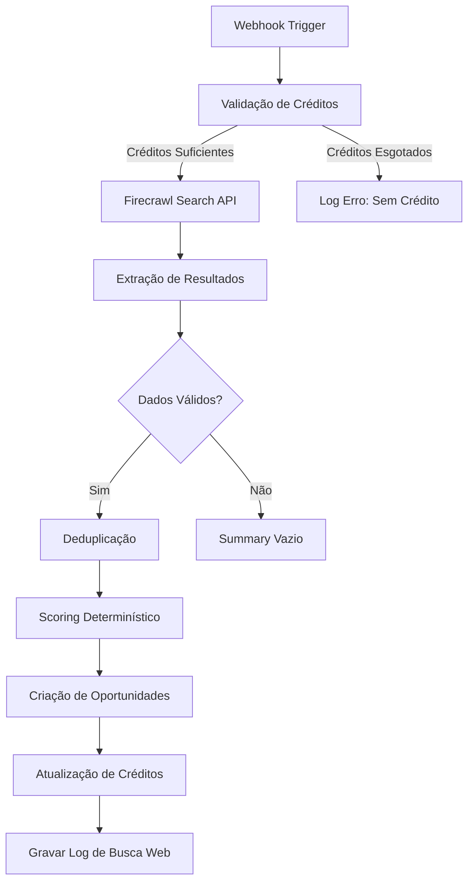

# Workflow de Descoberta Web com Firecrawl (n8n)

Este documento descreve a arquitetura e o funcionamento do workflow no n8n responsável por executar a busca de novas oportunidades comerciais (leads) utilizando a API do Firecrawl Search e sincronizá-las com o Supabase do HUVI.

---

## 1. Fluxo Geral de Execução



---

## 2. Detalhamento dos Passos

### Passo 1: Webhook Trigger
Recebe a requisição HTTP POST do frontend do HUVI contendo o payload:
```json
{
  "tenantId": "uuid-do-tenant",
  "keywords": ["clínica médica", "consultório odontológico"],
  "include_domains": [],
  "exclude_domains": [],
  "source_id": "uuid-da-fonte (opcional)",
  "testMode": false
}
```

### Passo 2: Validação de Créditos
Consulta a tabela `tenant_credits` para verificar se o tenant possui créditos ativos:
- **Regra**: `opportunity_used < opportunity_limit`

### Passo 3: Chamada Firecrawl Search API
Realiza uma requisição POST à API Firecrawl Search:
- **URL**: `{{FIRECRAWL_API_URL}}/search`
- **Headers**: `Authorization: Bearer {{FIRECRAWL_API_KEY}}`
- **Body**: `{ query: "keywords joined", limit: 30 }`
- **Timeout**: 30s

### Passo 4: Extração de Resultados
Mapeia os resultados da API para o formato HUVI:
- `title` → `company_name`
- `url` → `website`
- `description` → `description`

### Passo 5: Deduplicação
Verifica duplicatas por: website, telefone ou email (quando disponíveis).

### Passo 6: Scoring Determinístico
Conforme `gemini3.md`:

| Critério | Pontos |
|----------|--------|
| Telefone presente | +15 |
| Website presente | +20 |
| Email presente | +15 |
| Descrição rica (>100 chars) | +10 |
| Nome/título válido | +10 |
| **Total máximo** | **100** |

### Passo 7: Criação de Oportunidades
Insere novas oportunidades na tabela `opportunities` com `origin = 'Web Discovery'` e `source_service = 'Firecrawl'`.

### Passo 8: Atualização de Créditos
Incrementa `opportunity_used` na tabela `tenant_credits`.

### Passo 9: Gravar Log
Registra o resumo na tabela `web_search_log` para KPIs do frontend.

---

## 3. Variáveis de Ambiente Necessárias

| Variável | Descrição |
|----------|-----------|
| `FIRECRAWL_API_KEY` | Chave de API do Firecrawl |
| `FIRECRAWL_API_URL` | URL base da API (default: `https://api.firecrawl.dev/v1`) |
| `SUPABASE_URL` | URL do projeto Supabase |
| `SUPABASE_SERVICE_ROLE_KEY` | Chave de serviço do Supabase |

---

## 4. Diferenças para o Workflow Outscraper

| Aspecto | Outscraper | Firecrawl Web Discovery |
|---------|------------|------------------------|
| API | `api.outscraper.com/maps/search-v2` | `api.firecrawl.dev/v1/search` |
| Assíncrono | Sim (polling) | Não (síncrono) |
| Parâmetros | segment + state + city | keywords |
| Dados capturados | rating, reviews, endereço, Maps URL | descrição textual, URL |
| Tabela de log | `outscraper_search_log` | `web_search_log` |
| Fila | `outscraper_search_queue` | `web_search_queue` |

---

## 5. Regra de Deduplicação

Ordem de validação de duplicidade:
1. **Website**: Verifica se existe oportunidade com o mesmo domínio.
2. **Telefone**: Se não houver match de website, verifica telefone.
3. **Email**: Se não houver match anterior, verifica email.

Se duplicata encontrada: não criar, não consumir crédito, registrar no log.
