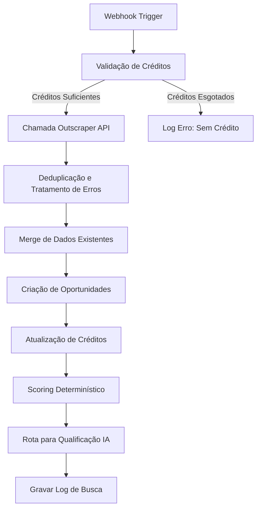

# Workflow de Descoberta com Outscraper (n8n)

Este documento descreve a arquitetura e o funcionamento do workflow no n8n responsável por executar a busca de novas oportunidades comerciais (leads) utilizando a API do Outscraper (Google Maps) e sincronizá-las com o Supabase do HUVI.

---

## 1. Fluxo Geral de Execução

O workflow é composto por 11 etapas principais:



---

## 2. Detalhamento dos Passos

### Passo 1: Webhook Trigger
Recebe a requisição HTTP POST do frontend do HUVI contendo o payload:
```json
{
  "tenantId": "uuid-do-tenant",
  "segment": "Clínicas Médicas",
  "state": "SP",
  "city": "São Paulo"
}
```

### Passo 2: Validação de Créditos
Consulta a tabela `tenant_credits` do Supabase para verificar se o tenant possui créditos ativos para o ciclo atual:
- **Regra**: `opportunity_used < opportunity_limit` e `cycle_reset_at > now()`.
- Se não houver créditos suficientes, a execução é interrompida e retorna uma mensagem de erro ao tenant.

### Passo 3: Chamada à API do Outscraper (Google Maps Search)
Realiza uma requisição HTTP à API do Outscraper usando os parâmetros recebidos.
- **Endpoint**: `https://api.outscraper.com/maps/search-v2`
- **Headers**: `X-API-KEY` (Armazenada como credencial segura/variável no n8n)
- **Query Parameters**:
  - `query`: `${segment} em ${city} - ${state}`
  - `limit`: `20` (limite controlado para MVP, ou proporcional aos créditos restantes)
- **Retry/Backoff**: Configurado para 3 tentativas com intervalo exponencial em caso de erro 429 ou timeout.

### Passo 4: Deduplicação e Tratamento de Erros
Com os dados recebidos, é aplicada a política de deduplicação (detalhada na seção 3).
Se a chamada à API falhar, o status da busca na fila `outscraper_search_queue` é atualizado para `failed` e gravado um log de erro.

### Passo 5: Merge de Dados Existentes
Caso uma empresa encontrada já exista no HUVI para aquele tenant (identificada via telefone ou website):
- Os campos nulos ou incompletos da oportunidade existente são atualizados com os novos dados do Google Maps (ex: se o site era nulo e o Maps forneceu, o site é atualizado).
- Cria-se um registro na tabela `opportunity_dedup_log`.

### Passo 6: Criação de Oportunidades
Insere as novas oportunidades exclusivas na tabela `opportunities` com `status = 'discovered'` e preenche os novos campos cadastrais:
- `address`, `rating_value`, `rating_count`, `google_maps_url`, `category`, `origin = 'Google Maps'`, `source_service = 'Outscraper'`.

### Passo 7: Atualização de Créditos
Calcula o número de novas oportunidades válidas inseridas e atualiza a tabela `tenant_credits` incrementando o campo `opportunity_used` na quantidade correspondente.

### Passo 8: Scoring Determinístico
Aplica as regras determinísticas de qualificação de leads com base nos dados obtidos do Google Maps para calcular o `score`:
- **Rating no Google Maps**: Avaliações baixas representam gargalos maiores e melhor oportunidade para o HUVI atuar.
  - Rating < 4.0: +30 pontos
  - Rating >= 4.0 e < 4.5: +15 pontos
  - Sem rating (nulo): +20 pontos
- **Presença Digital**:
  - Sem Website: +30 pontos
  - Sem Instagram: +20 pontos
  - Sem E-mail: +10 pontos
- **Telefone**:
  - Sem número cadastrado: -15 pontos (dificulta prospecção rápida)

### Passo 9: Rota de Qualificação IA (Auditor / Strategist)
Se a oportunidade atingir pontuação alta (score >= 70) e a IA estiver habilitada nas configurações do tenant, envia a oportunidade automaticamente para as filas dos agentes Auditor (Diagnóstico) e Strategist (Estratégia) no HUVI Brain.

### Passo 10: Gravar Log de Busca
Registra o resumo estatístico e financeiro na tabela `outscraper_search_log` para exibição no painel de KPIs do frontend:
- Quantidade encontrada, válidas criadas, duplicatas evitadas, custo em USD (calculado com base nas consultas realizadas) e status.

---

## 3. Regra de Deduplicação Oficial

Para manter a consistência dos dados de leads de cada tenant e evitar contatos duplicados, o n8n utiliza a seguinte ordem de validação de duplicidade:

1. **Telefone**: Verifica se existe alguma oportunidade com o mesmo telefone cadastrado para o tenant.
2. **Website**: Se não houver correspondência de telefone, verifica se existe alguma oportunidade com o mesmo domínio de website cadastrado.
3. **Similaridade de Nome**: Caso telefone e website não encontrem duplicados, aplica o algoritmo de similaridade de Levenshtein entre o nome recebido e as oportunidades existentes. Se a similaridade for maior ou igual a **90%**, é considerado duplicado.

Se uma duplicada for encontrada, os novos dados são mesclados na oportunidade existente (merge progressivo de campos vazios) e o crédito correspondente não é consumido.
